# 家計簿アプリ ER図

```mermaid
erDiagram
    %% ユーザー
    USERS {
        varchar id PK "ユーザーID"
        varchar username "ユーザー名 (UNIQUE)"
        varchar password_hash "パスワードハッシュ"
        bigint user_group_id FK "所属グループID（NULL可）"
        timestamp created_at
        timestamp updated_at
        boolean enabled
        integer version "バージョン"
    }

    %% オーソリティ
    AUTHORITIES {
        varchar username FK "ユーザー名"
        varchar authority "権限"
    }

    %% ユーザーグループ
    USER_GROUP {
        bigint id PK
        varchar group_name "グループ名"
        int month_start_day "月の始まり日"
        varchar created_by_user_id FK
        timestamp created_at
        timestamp updated_at
        integer version "バージョン"
    }


    %% グループ招待
    GROUP_INVITATION {
        bigint id PK "招待ID"
        bigint user_group_id FK
        varchar invited_user_id FK
        varchar invited_by_user_id FK
        varchar status "PENDING/ACCEPTED/REJECTED"
        timestamp invited_at
        timestamp responded_at
        timestamp created_at
        timestamp updated_at
    }

    %% 金融口座
    FINANCIAL_ACCOUNT {
        varchar id PK "UUID"
        varchar user_id FK
        varchar account_name "口座名"
        integer balance "残高"
        boolean is_main_account "メイン口座フラグ"
        timestamp created_at
        timestamp updated_at
        integer version "バージョン"
    }

    %% 預金残高編集履歴
    BALANCE_EDIT_HISTORY {
        varchar id PK "UUID"
        varchar financial_account_id FK "UUID"
        integer old_balance "変更前残高"
        integer new_balance "変更後残高"
        varchar edit_reason "編集理由"
        timestamp created_at
        integer version "バージョン"
    }

    %% 月次予算
    MONTHLY_BUDGET {
        bigint id PK "予算ID"
        bigint user_group_id FK
        int year "年"
        int month "月"
        integer budget_amount "予算額"
        varchar set_by_user_id FK
        timestamp created_at
        timestamp updated_at
        integer version "バージョン"
    }

    %% 生活費分類
    LIVING_EXPENSE_CATEGORY {
        bigint id PK
        bigint user_group_id FK
        varchar category_name "分類名"
        varchar description "説明"
        boolean is_default "デフォルト分類フラグ"
        timestamp created_at
        timestamp updated_at
        integer version "バージョン"
    }

    %% 日次グループ収支
    DAILY_GROUP_TRANSACTION {
        varchar id PK
        bigint user_group_id FK
        date transaction_date "取引日"
        timestamp created_at
        timestamp updated_at
        integer version "バージョン"
    }

    %% 日次生活費
    DAILY_LIVING_EXPENSE {
        varchar id PK
        varchar daily_group_transaction_id FK
        varchar user_id FK
        bigint living_expense_category_id FK
        integer amount "金額"
        varchar memo "メモ"
        timestamp created_at
        timestamp updated_at
        integer version "バージョン"
    }

    %% 日次個人収支
    DAILY_PERSONAL_TRANSACTION {
        varchar id PK
        varchar user_id FK
        date transaction_date "取引日"
        integer income "収入"
        timestamp created_at
        timestamp updated_at
        integer version "バージョン"
    }

    %% 日次個人支出
    DAILY_PERSONAL_EXPENSE {
        varchar id PK
        varchar daily_personal_transaction_id FK
        integer amount "金額"
        varchar memo "使用目的"
        timestamp created_at
        timestamp updated_at
        integer version "バージョン"
    }

    %% 日次予算残高
    DAILY_BUDGET_BALANCE {
        bigint user_group_id PK,FK
        date transaction_date PK "取引日"
        integer total_living_expense "生活費合計"
        integer budget_balance "予算残金"
        timestamp created_at
        timestamp updated_at
        integer version "バージョン"
    }

    %% 固定費分類
    FIXED_EXPENSE_CATEGORY {
        varchar id PK "UUID"
        bigint user_group_id FK
        varchar category_name "分類名"
        varchar description "説明"
        integer default_amount "デフォルト金額"
        timestamp created_at
        timestamp updated_at
        integer version "バージョン"
    }

    %% 固定費履歴
    FIXED_EXPENSE_HISTORY {
        varchar id PK "UUID"
        varchar fixed_expense_category_id FK "UUID"
        int year "年"
        int month "月"
        integer amount "金額"
        date effective_date "適用開始日"
        varchar memo "メモ"
        timestamp created_at
        timestamp updated_at
        integer version "バージョン"
    }

    %% 月次貯金
    MONTHLY_SAVING {
        varchar user_id PK,FK
        int year PK "年"
        int month PK "月"
        integer saving_amount "貯金額"
        varchar financial_account_id FK "UUID"
        varchar memo "メモ"
        timestamp created_at
        timestamp updated_at
        integer version "バージョン"
    }

    %% リレーションシップ
    USERS }|--|| USER_GROUP : "所属"
    USERS ||--|| AUTHORITIES : "権限"
    USERS ||--o{ FINANCIAL_ACCOUNT : "所有"
    USERS ||--o{ DAILY_PERSONAL_TRANSACTION : "記録"
    USERS ||--o{ MONTHLY_SAVING : "貯金"
    USERS ||--o{ MONTHLY_BUDGET : "設定"
    USERS ||--o{ GROUP_INVITATION : "招待"
    USERS ||--o{ GROUP_INVITATION : "被招待"
    USERS ||--o{ DAILY_LIVING_EXPENSE : "生活費記録"
    
    USER_GROUP ||--o{ GROUP_INVITATION : "招待管理"
    USER_GROUP ||--o{ MONTHLY_BUDGET : "予算管理"
    USER_GROUP ||--o{ LIVING_EXPENSE_CATEGORY : "分類管理"
    USER_GROUP ||--o{ FIXED_EXPENSE_CATEGORY : "固定費分類管理"
    USER_GROUP ||--o{ DAILY_GROUP_TRANSACTION : "グループ収支管理"

    FINANCIAL_ACCOUNT ||--o{ DAILY_PERSONAL_TRANSACTION : "取引記録"
    FINANCIAL_ACCOUNT ||--o{ MONTHLY_SAVING : "貯金先"
    FINANCIAL_ACCOUNT ||--o{ BALANCE_EDIT_HISTORY : "編集履歴"

    DAILY_GROUP_TRANSACTION ||--o{ DAILY_LIVING_EXPENSE : "生活費詳細"
    DAILY_PERSONAL_TRANSACTION ||--o{ DAILY_PERSONAL_EXPENSE : "個人支出詳細"
    
    LIVING_EXPENSE_CATEGORY ||--o{ DAILY_LIVING_EXPENSE : "分類"
    
    FIXED_EXPENSE_CATEGORY ||--o{ FIXED_EXPENSE_HISTORY : "履歴"
    
    USER_GROUP ||--o{ DAILY_BUDGET_BALANCE : "予算残高管理"
    
    MONTHLY_BUDGET ||--o{ DAILY_BUDGET_BALANCE : "予算基準"
    DAILY_LIVING_EXPENSE }o--|| DAILY_BUDGET_BALANCE : "生活費集計"
```

## エンティティ説明

### USERS（ユーザー）
- アプリケーションのユーザー情報を管理
- 認証に必要なユーザー名とパスワードハッシュを保持

### USER_GROUP（ユーザーグループ）
- 家計を共有するユーザーグループを管理
- 月の始まり日をグループごとに設定可能
- グループ作成者を記録

### GROUP_INVITATION（グループ招待）
- グループへの招待状を管理
- pending（未回答）、accepted（承認）、rejected（拒否）のステータス
- 有効期限なし

### FINANCIAL_ACCOUNT（金融口座）
- ユーザーごとの金融口座情報を管理
- メイン口座（変動費記録用）の識別
- 非共有データ（所有者のみ閲覧可能）

### BALANCE_EDIT_HISTORY（預金残高編集履歴）
- 預金残高の手動編集履歴を記録
- 編集理由を記録（編集者は口座所有者のみ）

### MONTHLY_BUDGET（月次予算）
- グループごとの月次予算を管理
- 生活費の予算額を設定
- 全メンバーが設定・更新可能
- 最後に設定したユーザーを記録

### LIVING_EXPENSE_CATEGORY（生活費分類）
- 生活費の分類をグループごとに管理
- デフォルト分類と追加分類を識別
- 共有データ（グループメンバー全員が閲覧可能）

### DAILY_PERSONAL_TRANSACTION（日次個人収支）
- ユーザーごとの日次収支情報を管理
- 収入、支出合計を記録
- 支出合計の計算式: (生活費合計 ÷ グループ人数) + 個人支出合計
- 非共有データ（記録者本人のみ閲覧可能）

### DAILY_GROUP_TRANSACTION（日次グループ収支）
- グループごとの日次収支情報を管理
- 支出合計と予算残高を記録
- 共有データ（グループメンバー全員が閲覧可能）

### DAILY_LIVING_EXPENSE（日次生活費）
- 生活費の詳細を分類別に記録
- 共有データ（グループメンバー全員が閲覧可能）

### DAILY_PERSONAL_EXPENSE（日次個人支出）
- 個人支出の詳細を記録
- メモ（使用目的）を記録
- 非共有データ（記録者本人のみ閲覧可能）

### DAILY_BUDGET_BALANCE（日次予算残高）
- グループごとの日次予算残高を管理
- 生活費合計と予算残金を記録
- 共有データ（グループメンバー全員が閲覧可能）
- 計算式: 前日予算残金 - 当日生活費合計

### FIXED_EXPENSE_CATEGORY（固定費分類）
- 固定費の分類をグループごとに管理
- 共有データ（グループメンバー全員が閲覧可能）

### FIXED_EXPENSE_HISTORY（固定費履歴）
- 月次の固定費実績を記録
- 共有データ（グループメンバー全員が閲覧可能）

### MONTHLY_SAVING（月次貯金）
- ユーザーごとの月次貯金実績を記録
- 非共有データ（記録者のみ閲覧可能）
- **設計補足**: 複合主キーは`user_id + year + month`を採用
  - `user_id`を含む理由: 同一口座を複数ユーザーが使用する場合でも、各ユーザーの貯金記録を個別に管理するため
  - 権限制御: 貯金額は非共有データであり、記録者本人のみが閲覧可能
  - `financial_account_id`は外部キーとして貯金先口座を特定

## データ共有ポリシー

### 共有データ（グループメンバー全員が閲覧可能）
- 生活費の記録（DAILY_LIVING_EXPENSE）
- 固定費情報（FIXED_EXPENSE_CATEGORY, FIXED_EXPENSE_HISTORY）
- 生活費分類（LIVING_EXPENSE_CATEGORY）
- 月次予算（MONTHLY_BUDGET）

### 非共有データ（記録者本人のみ閲覧可能）
- 個人支出の詳細（DAILY_PERSONAL_EXPENSE）
- 収入情報
- 貯金額（MONTHLY_SAVING）
- 預金残高（FINANCIAL_ACCOUNT）
- 残高編集履歴（BALANCE_EDIT_HISTORY）
